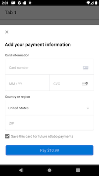
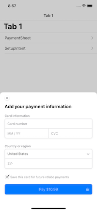
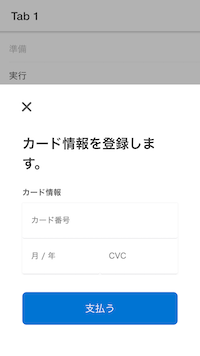
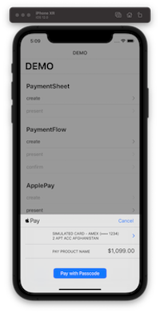
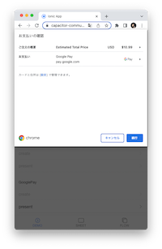

<p align="center"><br></p>

<h3 align="center">Stripe</h3>
<p align="center"><strong><code>@capacitor-community/stripe</code></strong></p>
<p align="center">
  Capacitor community plugin for native Stripe.
</p>

<p align="center">
  
  <a href="https://www.npmjs.com/package/@capacitor-community/stripe"></a>
<br>
  <a href="https://www.npmjs.com/package/@capacitor-community/stripe"></a>
  <a href="https://www.npmjs.com/package/@capacitor-community/stripe"></a>
</p>

## Maintainers

| Maintainer          | GitHub                              | Social                                | Sponsoring Company                             |
| ------------------- | ----------------------------------- | ------------------------------------- | ---------------------------------------------- |
| Hidetaka Okamoto | [hideokamoto](https://github.com/hideokamoto) | [@hide__dev](https://twitter.com/hide__dev) |  |
| Ibby Hadeed | [ihadeed](https://github.com/ihadeed) | |
| Masahiko Sakakibara | [rdlabo](https://github.com/rdlabo) | [@rdlabo](https://twitter.com/rdlabo) | RELATION DESIGN LABO, GENERAL INC. ASSOCIATION |

## Contributors ✨
<a href="https://github.com/capacitor-community/stripe/graphs/contributors">
  
</a>

Made with [contributors-img](https://contrib.rocks).

## How to use

Learn at [the official @capacitor-community/stripe documentation](https://stripe.capacitorjs.jp/).

日本語版をご利用の際は [ja.stripe.capacitorjs.jp](https://ja.stripe.capacitorjs.jp/) をご確認ください。

## Demo

- [Demo code is here](https://github.com/capacitor-community/stripe/tree/master/demo). Please check these code before ask at issues.
- Demo of Web is [hosting here](https://capacitor-community-stripe.netlify.app/).

### Screenshots

|  |  Android  |  iOS  |                     Web                     |
| :---: | :---: | :---: |:-------------------------------------------:|
|  PaymentSheet  |   |   |  |
|  PaymentFlow   |  |   |  |
|  ApplePay   | Not supported |   |                    beta.                    |
|  GooglePay   |   | Not supported |     |

## API

<docgen-index>

* [`isApplePayAvailable()`](#isapplepayavailable)
* [`createApplePay(...)`](#createapplepay)
* [`presentApplePay()`](#presentapplepay)
* [`addListener(ApplePayEventsEnum.Loaded, ...)`](#addlistenerapplepayeventsenumloaded)
* [`addListener(ApplePayEventsEnum.FailedToLoad, ...)`](#addlistenerapplepayeventsenumfailedtoload)
* [`addListener(ApplePayEventsEnum.FailedToLoad, ...)`](#addlistenerapplepayeventsenumfailedtoload)
* [`addListener(ApplePayEventsEnum.Completed, ...)`](#addlistenerapplepayeventsenumcompleted)
* [`addListener(ApplePayEventsEnum.Canceled, ...)`](#addlistenerapplepayeventsenumcanceled)
* [`addListener(ApplePayEventsEnum.Failed, ...)`](#addlistenerapplepayeventsenumfailed)
* [`isGooglePayAvailable()`](#isgooglepayavailable)
* [`createGooglePay(...)`](#creategooglepay)
* [`presentGooglePay()`](#presentgooglepay)
* [`addListener(GooglePayEventsEnum.Loaded, ...)`](#addlistenergooglepayeventsenumloaded)
* [`addListener(GooglePayEventsEnum.FailedToLoad, ...)`](#addlistenergooglepayeventsenumfailedtoload)
* [`addListener(GooglePayEventsEnum.FailedToLoad, ...)`](#addlistenergooglepayeventsenumfailedtoload)
* [`addListener(GooglePayEventsEnum.Completed, ...)`](#addlistenergooglepayeventsenumcompleted)
* [`addListener(GooglePayEventsEnum.Canceled, ...)`](#addlistenergooglepayeventsenumcanceled)
* [`addListener(GooglePayEventsEnum.Failed, ...)`](#addlistenergooglepayeventsenumfailed)
* [`createPaymentFlow(...)`](#createpaymentflow)
* [`presentPaymentFlow()`](#presentpaymentflow)
* [`confirmPaymentFlow()`](#confirmpaymentflow)
* [`addListener(PaymentFlowEventsEnum.Loaded, ...)`](#addlistenerpaymentfloweventsenumloaded)
* [`addListener(PaymentFlowEventsEnum.FailedToLoad, ...)`](#addlistenerpaymentfloweventsenumfailedtoload)
* [`addListener(PaymentFlowEventsEnum.Opened, ...)`](#addlistenerpaymentfloweventsenumopened)
* [`addListener(PaymentFlowEventsEnum.FailedToLoad, ...)`](#addlistenerpaymentfloweventsenumfailedtoload)
* [`addListener(PaymentFlowEventsEnum.Completed, ...)`](#addlistenerpaymentfloweventsenumcompleted)
* [`addListener(PaymentFlowEventsEnum.Canceled, ...)`](#addlistenerpaymentfloweventsenumcanceled)
* [`addListener(PaymentFlowEventsEnum.Failed, ...)`](#addlistenerpaymentfloweventsenumfailed)
* [`addListener(PaymentFlowEventsEnum.Created, ...)`](#addlistenerpaymentfloweventsenumcreated)
* [`createPaymentSheet(...)`](#createpaymentsheet)
* [`presentPaymentSheet()`](#presentpaymentsheet)
* [`addListener(PaymentSheetEventsEnum.Loaded, ...)`](#addlistenerpaymentsheeteventsenumloaded)
* [`addListener(PaymentSheetEventsEnum.FailedToLoad, ...)`](#addlistenerpaymentsheeteventsenumfailedtoload)
* [`addListener(PaymentSheetEventsEnum.Completed, ...)`](#addlistenerpaymentsheeteventsenumcompleted)
* [`addListener(PaymentSheetEventsEnum.Canceled, ...)`](#addlistenerpaymentsheeteventsenumcanceled)
* [`addListener(PaymentSheetEventsEnum.Failed, ...)`](#addlistenerpaymentsheeteventsenumfailed)
* [`initialize(...)`](#initialize)
* [`handleURLCallback(...)`](#handleurlcallback)
* [Interfaces](#interfaces)
* [Type Aliases](#type-aliases)
* [Enums](#enums)

</docgen-index>

<docgen-api>
<!--Update the source file JSDoc comments and rerun docgen to update the docs below-->

This is for @capacitor/docgen only.
Not use in product.

### isApplePayAvailable()

```typescript
isApplePayAvailable() => Promise<void>
```

--------------------


### createApplePay(...)

```typescript
createApplePay(options: CreateApplePayOption) => Promise<void>
```

| Param         | Type                                                                  |
| ------------- | --------------------------------------------------------------------- |
| **`options`** | <code><a href="#createapplepayoption">CreateApplePayOption</a></code> |

--------------------


### presentApplePay()

```typescript
presentApplePay() => Promise<{ paymentResult: ApplePayResultInterface; }>
```

**Returns:** <code>Promise&lt;{ paymentResult: <a href="#applepayresultinterface">ApplePayResultInterface</a>; }&gt;</code>

--------------------


### addListener(ApplePayEventsEnum.Loaded, ...)

```typescript
addListener(eventName: ApplePayEventsEnum.Loaded, listenerFunc: () => void) => PluginListenerHandle
```

| Param              | Type                                                                     |
| ------------------ | ------------------------------------------------------------------------ |
| **`eventName`**    | <code><a href="#applepayeventsenum">ApplePayEventsEnum.Loaded</a></code> |
| **`listenerFunc`** | <code>() =&gt; void</code>                                               |

**Returns:** <code><a href="#pluginlistenerhandle">PluginListenerHandle</a></code>

--------------------


### addListener(ApplePayEventsEnum.FailedToLoad, ...)

```typescript
addListener(eventName: ApplePayEventsEnum.FailedToLoad, listenerFunc: () => void) => PluginListenerHandle
```

| Param              | Type                                                                           |
| ------------------ | ------------------------------------------------------------------------------ |
| **`eventName`**    | <code><a href="#applepayeventsenum">ApplePayEventsEnum.FailedToLoad</a></code> |
| **`listenerFunc`** | <code>() =&gt; void</code>                                                     |

**Returns:** <code><a href="#pluginlistenerhandle">PluginListenerHandle</a></code>

--------------------


### addListener(ApplePayEventsEnum.FailedToLoad, ...)

```typescript
addListener(eventName: ApplePayEventsEnum.FailedToLoad, listenerFunc: () => void) => PluginListenerHandle
```

| Param              | Type                                                                           |
| ------------------ | ------------------------------------------------------------------------------ |
| **`eventName`**    | <code><a href="#applepayeventsenum">ApplePayEventsEnum.FailedToLoad</a></code> |
| **`listenerFunc`** | <code>() =&gt; void</code>                                                     |

**Returns:** <code><a href="#pluginlistenerhandle">PluginListenerHandle</a></code>

--------------------


### addListener(ApplePayEventsEnum.Completed, ...)

```typescript
addListener(eventName: ApplePayEventsEnum.Completed, listenerFunc: () => void) => PluginListenerHandle
```

| Param              | Type                                                                        |
| ------------------ | --------------------------------------------------------------------------- |
| **`eventName`**    | <code><a href="#applepayeventsenum">ApplePayEventsEnum.Completed</a></code> |
| **`listenerFunc`** | <code>() =&gt; void</code>                                                  |

**Returns:** <code><a href="#pluginlistenerhandle">PluginListenerHandle</a></code>

--------------------


### addListener(ApplePayEventsEnum.Canceled, ...)

```typescript
addListener(eventName: ApplePayEventsEnum.Canceled, listenerFunc: () => void) => PluginListenerHandle
```

| Param              | Type                                                                       |
| ------------------ | -------------------------------------------------------------------------- |
| **`eventName`**    | <code><a href="#applepayeventsenum">ApplePayEventsEnum.Canceled</a></code> |
| **`listenerFunc`** | <code>() =&gt; void</code>                                                 |

**Returns:** <code><a href="#pluginlistenerhandle">PluginListenerHandle</a></code>

--------------------


### addListener(ApplePayEventsEnum.Failed, ...)

```typescript
addListener(eventName: ApplePayEventsEnum.Failed, listenerFunc: () => void) => PluginListenerHandle
```

| Param              | Type                                                                     |
| ------------------ | ------------------------------------------------------------------------ |
| **`eventName`**    | <code><a href="#applepayeventsenum">ApplePayEventsEnum.Failed</a></code> |
| **`listenerFunc`** | <code>() =&gt; void</code>                                               |

**Returns:** <code><a href="#pluginlistenerhandle">PluginListenerHandle</a></code>

--------------------


### isGooglePayAvailable()

```typescript
isGooglePayAvailable() => Promise<void>
```

--------------------


### createGooglePay(...)

```typescript
createGooglePay(options: CreateGooglePayOption) => Promise<void>
```

| Param         | Type                                                                    |
| ------------- | ----------------------------------------------------------------------- |
| **`options`** | <code><a href="#creategooglepayoption">CreateGooglePayOption</a></code> |

--------------------


### presentGooglePay()

```typescript
presentGooglePay() => Promise<{ paymentResult: GooglePayResultInterface; }>
```

**Returns:** <code>Promise&lt;{ paymentResult: <a href="#googlepayresultinterface">GooglePayResultInterface</a>; }&gt;</code>

--------------------


### addListener(GooglePayEventsEnum.Loaded, ...)

```typescript
addListener(eventName: GooglePayEventsEnum.Loaded, listenerFunc: () => void) => PluginListenerHandle
```

| Param              | Type                                                                       |
| ------------------ | -------------------------------------------------------------------------- |
| **`eventName`**    | <code><a href="#googlepayeventsenum">GooglePayEventsEnum.Loaded</a></code> |
| **`listenerFunc`** | <code>() =&gt; void</code>                                                 |

**Returns:** <code><a href="#pluginlistenerhandle">PluginListenerHandle</a></code>

--------------------


### addListener(GooglePayEventsEnum.FailedToLoad, ...)

```typescript
addListener(eventName: GooglePayEventsEnum.FailedToLoad, listenerFunc: () => void) => PluginListenerHandle
```

| Param              | Type                                                                             |
| ------------------ | -------------------------------------------------------------------------------- |
| **`eventName`**    | <code><a href="#googlepayeventsenum">GooglePayEventsEnum.FailedToLoad</a></code> |
| **`listenerFunc`** | <code>() =&gt; void</code>                                                       |

**Returns:** <code><a href="#pluginlistenerhandle">PluginListenerHandle</a></code>

--------------------


### addListener(GooglePayEventsEnum.FailedToLoad, ...)

```typescript
addListener(eventName: GooglePayEventsEnum.FailedToLoad, listenerFunc: () => void) => PluginListenerHandle
```

| Param              | Type                                                                             |
| ------------------ | -------------------------------------------------------------------------------- |
| **`eventName`**    | <code><a href="#googlepayeventsenum">GooglePayEventsEnum.FailedToLoad</a></code> |
| **`listenerFunc`** | <code>() =&gt; void</code>                                                       |

**Returns:** <code><a href="#pluginlistenerhandle">PluginListenerHandle</a></code>

--------------------


### addListener(GooglePayEventsEnum.Completed, ...)

```typescript
addListener(eventName: GooglePayEventsEnum.Completed, listenerFunc: () => void) => PluginListenerHandle
```

| Param              | Type                                                                          |
| ------------------ | ----------------------------------------------------------------------------- |
| **`eventName`**    | <code><a href="#googlepayeventsenum">GooglePayEventsEnum.Completed</a></code> |
| **`listenerFunc`** | <code>() =&gt; void</code>                                                    |

**Returns:** <code><a href="#pluginlistenerhandle">PluginListenerHandle</a></code>

--------------------


### addListener(GooglePayEventsEnum.Canceled, ...)

```typescript
addListener(eventName: GooglePayEventsEnum.Canceled, listenerFunc: () => void) => PluginListenerHandle
```

| Param              | Type                                                                         |
| ------------------ | ---------------------------------------------------------------------------- |
| **`eventName`**    | <code><a href="#googlepayeventsenum">GooglePayEventsEnum.Canceled</a></code> |
| **`listenerFunc`** | <code>() =&gt; void</code>                                                   |

**Returns:** <code><a href="#pluginlistenerhandle">PluginListenerHandle</a></code>

--------------------


### addListener(GooglePayEventsEnum.Failed, ...)

```typescript
addListener(eventName: GooglePayEventsEnum.Failed, listenerFunc: () => void) => PluginListenerHandle
```

| Param              | Type                                                                       |
| ------------------ | -------------------------------------------------------------------------- |
| **`eventName`**    | <code><a href="#googlepayeventsenum">GooglePayEventsEnum.Failed</a></code> |
| **`listenerFunc`** | <code>() =&gt; void</code>                                                 |

**Returns:** <code><a href="#pluginlistenerhandle">PluginListenerHandle</a></code>

--------------------


### createPaymentFlow(...)

```typescript
createPaymentFlow(options: CreatePaymentFlowOption) => Promise<void>
```

| Param         | Type                                                                        |
| ------------- | --------------------------------------------------------------------------- |
| **`options`** | <code><a href="#createpaymentflowoption">CreatePaymentFlowOption</a></code> |

--------------------


### presentPaymentFlow()

```typescript
presentPaymentFlow() => Promise<{ cardNumber: string; }>
```

**Returns:** <code>Promise&lt;{ cardNumber: string; }&gt;</code>

--------------------


### confirmPaymentFlow()

```typescript
confirmPaymentFlow() => Promise<{ paymentResult: PaymentFlowResultInterface; }>
```

**Returns:** <code>Promise&lt;{ paymentResult: <a href="#paymentflowresultinterface">PaymentFlowResultInterface</a>; }&gt;</code>

--------------------


### addListener(PaymentFlowEventsEnum.Loaded, ...)

```typescript
addListener(eventName: PaymentFlowEventsEnum.Loaded, listenerFunc: () => void) => PluginListenerHandle
```

| Param              | Type                                                                           |
| ------------------ | ------------------------------------------------------------------------------ |
| **`eventName`**    | <code><a href="#paymentfloweventsenum">PaymentFlowEventsEnum.Loaded</a></code> |
| **`listenerFunc`** | <code>() =&gt; void</code>                                                     |

**Returns:** <code><a href="#pluginlistenerhandle">PluginListenerHandle</a></code>

--------------------


### addListener(PaymentFlowEventsEnum.FailedToLoad, ...)

```typescript
addListener(eventName: PaymentFlowEventsEnum.FailedToLoad, listenerFunc: () => void) => PluginListenerHandle
```

| Param              | Type                                                                                 |
| ------------------ | ------------------------------------------------------------------------------------ |
| **`eventName`**    | <code><a href="#paymentfloweventsenum">PaymentFlowEventsEnum.FailedToLoad</a></code> |
| **`listenerFunc`** | <code>() =&gt; void</code>                                                           |

**Returns:** <code><a href="#pluginlistenerhandle">PluginListenerHandle</a></code>

--------------------


### addListener(PaymentFlowEventsEnum.Opened, ...)

```typescript
addListener(eventName: PaymentFlowEventsEnum.Opened, listenerFunc: () => void) => PluginListenerHandle
```

| Param              | Type                                                                           |
| ------------------ | ------------------------------------------------------------------------------ |
| **`eventName`**    | <code><a href="#paymentfloweventsenum">PaymentFlowEventsEnum.Opened</a></code> |
| **`listenerFunc`** | <code>() =&gt; void</code>                                                     |

**Returns:** <code><a href="#pluginlistenerhandle">PluginListenerHandle</a></code>

--------------------


### addListener(PaymentFlowEventsEnum.FailedToLoad, ...)

```typescript
addListener(eventName: PaymentFlowEventsEnum.FailedToLoad, listenerFunc: () => void) => PluginListenerHandle
```

| Param              | Type                                                                                 |
| ------------------ | ------------------------------------------------------------------------------------ |
| **`eventName`**    | <code><a href="#paymentfloweventsenum">PaymentFlowEventsEnum.FailedToLoad</a></code> |
| **`listenerFunc`** | <code>() =&gt; void</code>                                                           |

**Returns:** <code><a href="#pluginlistenerhandle">PluginListenerHandle</a></code>

--------------------


### addListener(PaymentFlowEventsEnum.Completed, ...)

```typescript
addListener(eventName: PaymentFlowEventsEnum.Completed, listenerFunc: () => void) => PluginListenerHandle
```

| Param              | Type                                                                              |
| ------------------ | --------------------------------------------------------------------------------- |
| **`eventName`**    | <code><a href="#paymentfloweventsenum">PaymentFlowEventsEnum.Completed</a></code> |
| **`listenerFunc`** | <code>() =&gt; void</code>                                                        |

**Returns:** <code><a href="#pluginlistenerhandle">PluginListenerHandle</a></code>

--------------------


### addListener(PaymentFlowEventsEnum.Canceled, ...)

```typescript
addListener(eventName: PaymentFlowEventsEnum.Canceled, listenerFunc: () => void) => PluginListenerHandle
```

| Param              | Type                                                                             |
| ------------------ | -------------------------------------------------------------------------------- |
| **`eventName`**    | <code><a href="#paymentfloweventsenum">PaymentFlowEventsEnum.Canceled</a></code> |
| **`listenerFunc`** | <code>() =&gt; void</code>                                                       |

**Returns:** <code><a href="#pluginlistenerhandle">PluginListenerHandle</a></code>

--------------------


### addListener(PaymentFlowEventsEnum.Failed, ...)

```typescript
addListener(eventName: PaymentFlowEventsEnum.Failed, listenerFunc: () => void) => PluginListenerHandle
```

| Param              | Type                                                                           |
| ------------------ | ------------------------------------------------------------------------------ |
| **`eventName`**    | <code><a href="#paymentfloweventsenum">PaymentFlowEventsEnum.Failed</a></code> |
| **`listenerFunc`** | <code>() =&gt; void</code>                                                     |

**Returns:** <code><a href="#pluginlistenerhandle">PluginListenerHandle</a></code>

--------------------


### addListener(PaymentFlowEventsEnum.Created, ...)

```typescript
addListener(eventName: PaymentFlowEventsEnum.Created, listenerFunc: (info: { cardNumber: string; }) => void) => PluginListenerHandle
```

| Param              | Type                                                                            |
| ------------------ | ------------------------------------------------------------------------------- |
| **`eventName`**    | <code><a href="#paymentfloweventsenum">PaymentFlowEventsEnum.Created</a></code> |
| **`listenerFunc`** | <code>(info: { cardNumber: string; }) =&gt; void</code>                         |

**Returns:** <code><a href="#pluginlistenerhandle">PluginListenerHandle</a></code>

--------------------


### createPaymentSheet(...)

```typescript
createPaymentSheet(options: CreatePaymentSheetOption) => Promise<void>
```

| Param         | Type                                                                          |
| ------------- | ----------------------------------------------------------------------------- |
| **`options`** | <code><a href="#createpaymentsheetoption">CreatePaymentSheetOption</a></code> |

--------------------


### presentPaymentSheet()

```typescript
presentPaymentSheet() => Promise<{ paymentResult: PaymentSheetResultInterface; }>
```

**Returns:** <code>Promise&lt;{ paymentResult: <a href="#paymentsheetresultinterface">PaymentSheetResultInterface</a>; }&gt;</code>

--------------------


### addListener(PaymentSheetEventsEnum.Loaded, ...)

```typescript
addListener(eventName: PaymentSheetEventsEnum.Loaded, listenerFunc: () => void) => PluginListenerHandle
```

| Param              | Type                                                                             |
| ------------------ | -------------------------------------------------------------------------------- |
| **`eventName`**    | <code><a href="#paymentsheeteventsenum">PaymentSheetEventsEnum.Loaded</a></code> |
| **`listenerFunc`** | <code>() =&gt; void</code>                                                       |

**Returns:** <code><a href="#pluginlistenerhandle">PluginListenerHandle</a></code>

--------------------


### addListener(PaymentSheetEventsEnum.FailedToLoad, ...)

```typescript
addListener(eventName: PaymentSheetEventsEnum.FailedToLoad, listenerFunc: () => void) => PluginListenerHandle
```

| Param              | Type                                                                                   |
| ------------------ | -------------------------------------------------------------------------------------- |
| **`eventName`**    | <code><a href="#paymentsheeteventsenum">PaymentSheetEventsEnum.FailedToLoad</a></code> |
| **`listenerFunc`** | <code>() =&gt; void</code>                                                             |

**Returns:** <code><a href="#pluginlistenerhandle">PluginListenerHandle</a></code>

--------------------


### addListener(PaymentSheetEventsEnum.Completed, ...)

```typescript
addListener(eventName: PaymentSheetEventsEnum.Completed, listenerFunc: () => void) => PluginListenerHandle
```

| Param              | Type                                                                                |
| ------------------ | ----------------------------------------------------------------------------------- |
| **`eventName`**    | <code><a href="#paymentsheeteventsenum">PaymentSheetEventsEnum.Completed</a></code> |
| **`listenerFunc`** | <code>() =&gt; void</code>                                                          |

**Returns:** <code><a href="#pluginlistenerhandle">PluginListenerHandle</a></code>

--------------------


### addListener(PaymentSheetEventsEnum.Canceled, ...)

```typescript
addListener(eventName: PaymentSheetEventsEnum.Canceled, listenerFunc: () => void) => PluginListenerHandle
```

| Param              | Type                                                                               |
| ------------------ | ---------------------------------------------------------------------------------- |
| **`eventName`**    | <code><a href="#paymentsheeteventsenum">PaymentSheetEventsEnum.Canceled</a></code> |
| **`listenerFunc`** | <code>() =&gt; void</code>                                                         |

**Returns:** <code><a href="#pluginlistenerhandle">PluginListenerHandle</a></code>

--------------------


### addListener(PaymentSheetEventsEnum.Failed, ...)

```typescript
addListener(eventName: PaymentSheetEventsEnum.Failed, listenerFunc: () => void) => PluginListenerHandle
```

| Param              | Type                                                                             |
| ------------------ | -------------------------------------------------------------------------------- |
| **`eventName`**    | <code><a href="#paymentsheeteventsenum">PaymentSheetEventsEnum.Failed</a></code> |
| **`listenerFunc`** | <code>() =&gt; void</code>                                                       |

**Returns:** <code><a href="#pluginlistenerhandle">PluginListenerHandle</a></code>

--------------------


### initialize(...)

```typescript
initialize(opts: StripeInitializationOptions) => Promise<void>
```

| Param      | Type                                                                                |
| ---------- | ----------------------------------------------------------------------------------- |
| **`opts`** | <code><a href="#stripeinitializationoptions">StripeInitializationOptions</a></code> |

--------------------


### handleURLCallback(...)

```typescript
handleURLCallback(opts: StripeURLHandlingOptions) => Promise<void>
```

iOS Only

| Param      | Type                                                                          |
| ---------- | ----------------------------------------------------------------------------- |
| **`opts`** | <code><a href="#stripeurlhandlingoptions">StripeURLHandlingOptions</a></code> |

--------------------


### Interfaces


#### CreateApplePayOption

| Prop                            | Type                                              |
| ------------------------------- | ------------------------------------------------- |
| **`paymentIntentClientSecret`** | <code>string</code>                               |
| **`paymentSummaryItems`**       | <code>{ label: string; amount: number; }[]</code> |
| **`merchantIdentifier`**        | <code>string</code>                               |
| **`countryCode`**               | <code>string</code>                               |
| **`currency`**                  | <code>string</code>                               |


#### PluginListenerHandle

| Prop         | Type                                      |
| ------------ | ----------------------------------------- |
| **`remove`** | <code>() =&gt; Promise&lt;void&gt;</code> |


#### CreateGooglePayOption

| Prop                            | Type                                              | Description                                               |
| ------------------------------- | ------------------------------------------------- | --------------------------------------------------------- |
| **`paymentIntentClientSecret`** | <code>string</code>                               |                                                           |
| **`paymentSummaryItems`**       | <code>{ label: string; amount: number; }[]</code> | Web only need @stripe-elements/stripe-elements &gt; 1.1.0 |
| **`merchantIdentifier`**        | <code>string</code>                               | Web only need @stripe-elements/stripe-elements &gt; 1.1.0 |
| **`countryCode`**               | <code>string</code>                               | Web only need @stripe-elements/stripe-elements &gt; 1.1.0 |
| **`currency`**                  | <code>string</code>                               | Web only need @stripe-elements/stripe-elements &gt; 1.1.0 |


#### CreatePaymentFlowOption

| Prop                             | Type                                       | Description                                                                                      | Default                 |
| -------------------------------- | ------------------------------------------ | ------------------------------------------------------------------------------------------------ | ----------------------- |
| **`paymentIntentClientSecret`**  | <code>string</code>                        | Any documentation call 'paymentIntent' Set paymentIntentClientSecret or setupIntentClientSecret  |                         |
| **`setupIntentClientSecret`**    | <code>string</code>                        | Any documentation call 'paymentIntent' Set paymentIntentClientSecret or setupIntentClientSecret  |                         |
| **`customerEphemeralKeySecret`** | <code>string</code>                        | Any documentation call 'ephemeralKey'                                                            |                         |
| **`customerId`**                 | <code>string</code>                        | Any documentation call 'customer'                                                                |                         |
| **`enableApplePay`**             | <code>boolean</code>                       | If you set payment method ApplePay, this set true                                                | <code>false</code>      |
| **`applePayMerchantId`**         | <code>string</code>                        | If set enableApplePay false, Plugin ignore here.                                                 |                         |
| **`enableGooglePay`**            | <code>boolean</code>                       | If you set payment method GooglePay, this set true                                               | <code>false</code>      |
| **`GooglePayIsTesting`**         | <code>boolean</code>                       |                                                                                                  | <code>false,</code>     |
| **`countryCode`**                | <code>string</code>                        | use ApplePay and GooglePay. If set enableApplePay and enableGooglePay false, Plugin ignore here. | <code>"US"</code>       |
| **`merchantDisplayName`**        | <code>string</code>                        |                                                                                                  | <code>"App Name"</code> |
| **`returnURL`**                  | <code>string</code>                        |                                                                                                  | <code>""</code>         |
| **`style`**                      | <code>'alwaysLight' \| 'alwaysDark'</code> | iOS Only                                                                                         | <code>undefined</code>  |
| **`withZipCode`**                | <code>boolean</code>                       | Platform: Web only Show ZIP code field.                                                          | <code>true</code>       |


#### CreatePaymentSheetOption

| Prop                             | Type                                       | Description                                                                                      | Default                 |
| -------------------------------- | ------------------------------------------ | ------------------------------------------------------------------------------------------------ | ----------------------- |
| **`paymentIntentClientSecret`**  | <code>string</code>                        | Any documentation call 'paymentIntent' Set paymentIntentClientSecret or setupIntentClientSecret  |                         |
| **`setupIntentClientSecret`**    | <code>string</code>                        | Any documentation call 'paymentIntent' Set paymentIntentClientSecret or setupIntentClientSecret  |                         |
| **`customerEphemeralKeySecret`** | <code>string</code>                        | Any documentation call 'ephemeralKey'                                                            |                         |
| **`customerId`**                 | <code>string</code>                        | Any documentation call 'customer'                                                                |                         |
| **`enableApplePay`**             | <code>boolean</code>                       | If you set payment method ApplePay, this set true                                                | <code>false</code>      |
| **`applePayMerchantId`**         | <code>string</code>                        | If set enableApplePay false, Plugin ignore here.                                                 |                         |
| **`enableGooglePay`**            | <code>boolean</code>                       | If you set payment method GooglePay, this set true                                               | <code>false</code>      |
| **`GooglePayIsTesting`**         | <code>boolean</code>                       |                                                                                                  | <code>false,</code>     |
| **`countryCode`**                | <code>string</code>                        | use ApplePay and GooglePay. If set enableApplePay and enableGooglePay false, Plugin ignore here. | <code>"US"</code>       |
| **`merchantDisplayName`**        | <code>string</code>                        |                                                                                                  | <code>"App Name"</code> |
| **`returnURL`**                  | <code>string</code>                        |                                                                                                  | <code>""</code>         |
| **`style`**                      | <code>'alwaysLight' \| 'alwaysDark'</code> | iOS Only                                                                                         | <code>undefined</code>  |
| **`withZipCode`**                | <code>boolean</code>                       | Platform: Web only Show ZIP code field.                                                          | <code>true</code>       |


#### StripeInitializationOptions

| Prop                 | Type                | Description                                       |
| -------------------- | ------------------- | ------------------------------------------------- |
| **`publishableKey`** | <code>string</code> |                                                   |
| **`stripeAccount`**  | <code>string</code> | Optional. Making API calls for connected accounts |


#### StripeURLHandlingOptions

| Prop      | Type                |
| --------- | ------------------- |
| **`url`** | <code>string</code> |


#### StripePlugin

| Method                | Signature                                                                                                | Description |
| --------------------- | -------------------------------------------------------------------------------------------------------- | ----------- |
| **initialize**        | (opts: <a href="#stripeinitializationoptions">StripeInitializationOptions</a>) =&gt; Promise&lt;void&gt; |             |
| **handleURLCallback** | (opts: <a href="#stripeurlhandlingoptions">StripeURLHandlingOptions</a>) =&gt; Promise&lt;void&gt;       | iOS Only    |


#### CapacitorStripeContext

| Prop                       | Type                                                  |
| -------------------------- | ----------------------------------------------------- |
| **`stripe`**               | <code><a href="#stripeplugin">StripePlugin</a></code> |
| **`isApplePayAvailable`**  | <code>boolean</code>                                  |
| **`isGooglePayAvailable`** | <code>boolean</code>                                  |


### Type Aliases


#### ApplePayResultInterface

<code><a href="#applepayeventsenum">ApplePayEventsEnum.Completed</a> | <a href="#applepayeventsenum">ApplePayEventsEnum.Canceled</a> | <a href="#applepayeventsenum">ApplePayEventsEnum.Failed</a></code>


#### GooglePayResultInterface

<code><a href="#googlepayeventsenum">GooglePayEventsEnum.Completed</a> | <a href="#googlepayeventsenum">GooglePayEventsEnum.Canceled</a> | <a href="#googlepayeventsenum">GooglePayEventsEnum.Failed</a></code>


#### PaymentFlowResultInterface

<code><a href="#paymentfloweventsenum">PaymentFlowEventsEnum.Completed</a> | <a href="#paymentfloweventsenum">PaymentFlowEventsEnum.Canceled</a> | <a href="#paymentfloweventsenum">PaymentFlowEventsEnum.Failed</a></code>


#### PaymentSheetResultInterface

<code><a href="#paymentsheeteventsenum">PaymentSheetEventsEnum.Completed</a> | <a href="#paymentsheeteventsenum">PaymentSheetEventsEnum.Canceled</a> | <a href="#paymentsheeteventsenum">PaymentSheetEventsEnum.Failed</a></code>


### Enums


#### ApplePayEventsEnum

| Members            | Value                               |
| ------------------ | ----------------------------------- |
| **`Loaded`**       | <code>"applePayLoaded"</code>       |
| **`FailedToLoad`** | <code>"applePayFailedToLoad"</code> |
| **`Completed`**    | <code>"applePayCompleted"</code>    |
| **`Canceled`**     | <code>"applePayCanceled"</code>     |
| **`Failed`**       | <code>"applePayFailed"</code>       |


#### GooglePayEventsEnum

| Members            | Value                                |
| ------------------ | ------------------------------------ |
| **`Loaded`**       | <code>"googlePayLoaded"</code>       |
| **`FailedToLoad`** | <code>"googlePayFailedToLoad"</code> |
| **`Completed`**    | <code>"googlePayCompleted"</code>    |
| **`Canceled`**     | <code>"googlePayCanceled"</code>     |
| **`Failed`**       | <code>"googlePayFailed"</code>       |


#### PaymentFlowEventsEnum

| Members            | Value                                  |
| ------------------ | -------------------------------------- |
| **`Loaded`**       | <code>"paymentFlowLoaded"</code>       |
| **`FailedToLoad`** | <code>"paymentFlowFailedToLoad"</code> |
| **`Opened`**       | <code>"paymentFlowOpened"</code>       |
| **`Created`**      | <code>"paymentFlowCreated"</code>      |
| **`Completed`**    | <code>"paymentFlowCompleted"</code>    |
| **`Canceled`**     | <code>"paymentFlowCanceled"</code>     |
| **`Failed`**       | <code>"paymentFlowFailed"</code>       |


#### PaymentSheetEventsEnum

| Members            | Value                                   |
| ------------------ | --------------------------------------- |
| **`Loaded`**       | <code>"paymentSheetLoaded"</code>       |
| **`FailedToLoad`** | <code>"paymentSheetFailedToLoad"</code> |
| **`Completed`**    | <code>"paymentSheetCompleted"</code>    |
| **`Canceled`**     | <code>"paymentSheetCanceled"</code>     |
| **`Failed`**       | <code>"paymentSheetFailed"</code>       |

</docgen-api>


## License

@capacitor-community/stripe is [MIT licensed](./LICENSE).
